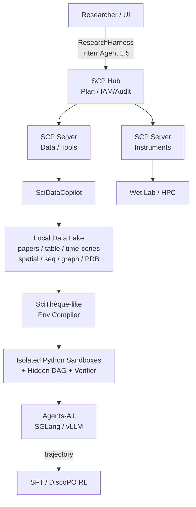

> 上海人工智能実験室 の実験環境を今一度、網羅的に調査してください。
オンプレミスで実現可能か、可能ならばどのようなデータセットとそれを捌く環境が想定されるか調査ベースでお願いします。

はい。改めて、上海AI実験室の公式発表・公式GitHub/Hugging Face・論文を中心に、「モデル」ではなく実験環境そのものを追いました。

結論から言うと、かなりの部分をオンプレミスで再構成できます。しかもこれは私の推測だけではなく、上海AI実験室自身が2026年7月に「ローカル優先・計算隔離・外網アクセス制御」を明示し、さらにローカルで使えるデスクトップ版の投入を予告しています。現在の本体「書生・端砚」を丸ごと同一構成で複製するのはまだ無理ですが、Dry Lab側の研究環境は公開技術だけでも相当近いものを作れます。 

## 1. 今の上海AI実験室は何を「実験環境」と考えているか

2025年のIntern-Discoveryより、2026年7月公開の「書生・端砚」を見る方が分かりやすいです。公式には現在のプラットフォームを、

> 算力 → データ → モデル → Agent → 自主実験

という5層で説明しています。単なるLLM＋Pythonではありません。 

| 層                  | 上海AI実験室の現在の構成                | オンプレ再現性              |
| ------------------ | ---------------------------- | -------------------- |
| 算力                 | DeepLink、超算・智算センター連携         | ○ 単一組織ならもっと簡略化可能     |
| データ                | Sciverse、PB級AI-Ready data    | △ 全量は不要/困難           |
| データ加工              | MinerU、SciDataCopilot        | ◎                    |
| 基盤モデル              | Intern-S2-Preview-397B等      | △ S2そのものではなくA1等で代替可能 |
| Agent runtime      | InternAgent、ResearchHarness等 | ◎                    |
| 実験環境               | SciThèque型sandbox＋verifier   | ○〜◎                  |
| Tool orchestration | SCP Hub / SCP Server         | ◎、self-host公式対応      |
| Wet Lab            | SCP＋自動実験装置                   | ○ 装置を所有していれば可能       |
| セキュリティ             | sandbox、権限、白名单、監査            | ◎                    |

「端砚」自体は、生命科学、重要材料、半導体、核融合、量子、地球・気象という6領域です。生命科学ではAlphaFold・BLAST・UniProt、材料ではMaterials Project・RDKit・第一原理計算、地球科学ではリモートセンシングや専門モデルを接続しています。生成物も単なる回答文ではなく、LaTeX、図表、SMILES、PDB、スペクトル原データ、実行可能コード、実験パラメータまで保存する設計です。 

ここが重要で、彼らが作っているのは「AIチャット」よりむしろ、

研究用データレイク + Jupyter/HPC + Agent + 実験管理システム + verifier + LIMS的な監査系

に近いものです。

---

## 2. オンプレについては、かなり明確に「YES」

2026年7月17日のWAICで周伯文氏は、「端砚」のセキュリティ設計についてローカル優先、計算隔離、外部ネットワークアクセス制御を明言しています。そして「1か月後に公開β、2か月後にデスクトップ版を正式公開し、ローカルにダウンロードして利用可能にする」というロードマップも説明しています。 

今日は2026年8月13日なので、予定通りならデスクトップ版は2026年9月中旬ごろが目安になります。ただし、これは7月17日時点の予告であって、現時点で正式リリース済みとは確認できません。

一方、下位層のSCPはさらに明確です。公式GitHubに

Self-Hosted Deployment — own SCP Server and Hub

が用意されており、HubとServerを自組織内に置けます。SCP Hubが計画・スケジューリング・権限管理、SCP Serverがローカルのモデル、DB、計算機、実験装置を担当するHub-Spoke構成です。 

したがって、オンプレ構築を前提にするならSCPを背骨にするのが最も上海AI実験室の思想に近いです。

---

## 3. 最も重要なのは「どんなデータを置くか」より「データをどう実験環境化するか」

今回調べ直して、一番重要だと思ったのが2026年7月31日のSciDisco / SciThèqueです。

これは上海AI実験室が実際にAgent学習用の科学実験環境をどう作っているか、かなり細部まで公開しています。

SciThèqueでは、単にCSVをAgentに渡しません。

Scientific Dataset
        ↓
dataset profiling
        ↓
Hypothesis generation
        ↓
Reference analysis
        ↓
Hidden Evidence DAG
        ↓
Verifier
        ↓
Sandbox
        ↓
Agent interaction

と変換します。各実験環境には、自然言語の仮説、実データ、sandbox、隠されたevidence DAG、verifier、最終checker、再現性メタデータがあります。Agentには仮説とデータだけを見せ、正解や採点ロジックは隠します。 

これこそ、オンプレ版を作る際に真似すべき部分です。

---

## 4. 実際に上海AI実験室が使っている1,686個の実験環境

SciThèqueの2026年7月時点のsnapshotは1,686環境です。

| モダリティ       | 環境数   |
| ----------- | ----- |
| Tabular     | 1,024 |
| Time series | 287   |
| Spatial     | 206   |
| Sequence    | 114   |
| Graph       | 55    |
合計	1,686

分野はEconomics 452、Medicine 334、Biology 325、Earth Science 219、Engineering 127、Epidemiology 119などです。さらに504個のstress variantがあります。 

そしてデータ源まで明記されています。

| データ源         | SciThèque環境数 | 記録されている利用条件                             |
| ------------ | ------------ | --------------------------------------- |
| UCI          | 678          | redistributable                         |
| OpenML       | 475          | Public domain / CC0 / CC BY / CC BY-SA等 |
| FRED         | 151          | Public domain                           |
| UniProt      | 114          | CC BY 4.0                               |
| CDC FluView  | 65           | Public domain                           |
| USGS         | 41           | Public domain                           |
| CDC PLACES   | 36           | Public domain                           |
| Yelp         | 40           | CC BY-NC-ND 4.0                         |
| Monash       | 31           | CC BY 4.0                               |
| STRING yeast | 34           | CC BY 4.0                               |
| OGB          | 21           | MIT                                     |

これならオンプレにできます。

むしろ最初からPB級データを集める必要はありません。上海AI実験室自身の最新Agent-RL研究でさえ、まずこのような小〜中規模の構造化科学データを多数の「検証可能な環境」に変換するアプローチを取っています。

またライセンスはかなり重要です。SciDisco論文も、派生データには元データの利用条件が残り、NC/ND系データを勝手に別ライセンスで再配布してはいけないことを明記しています。 

---

## 5. Sandboxは意外に普通です

SciThèqueのAgent側インターフェースも非常に参考になります。

基本的には、

<thought>
次に何を調べるか
</thought>
<python>
普通のscientific Python
</python>
→ observation
→ 次のturn

です。

Python kernelはturnをまたいでpersistentです。そのため前のセルで作ったDataFrame、モデル、変数をそのまま次のturnで利用します。例としてCDC FluViewのParquetをpandasでロードし、Granger causality、stationarity、残差診断、感度分析などを順番に行っています。 

学習時には1 actionあたり60秒のtimeout、最大30 turns、1 turn最大4,096 tokens、trajectory context 24,576 tokensという設定です。 

つまりオンプレで必要なのは特殊な「科学OS」ではなく、

隔離されたPython kernelを大量に生成して、Agentに継続的に操作させる環境

です。

Docker/Kubernetes系でも十分再現できます。

---

## 6. データ加工層はSciDataCopilotがほぼそのまま使える

Raw dataを直接SciThèqueに食わせるのではなく、その前にSciDataCopilotを置くのが非常に自然です。

これはApache-2.0で公開され、設計が

> Data Lake + Tool Lake + Case Lake

になっています。データ取得→意図解釈→プロファイリング→処理計画→tool/Python実行→結果統合という流れです。ローカルパスが最優先で、なければData Lake、それでもなければ取得toolへ回ります。 

重要なのは、LLM endpointも

`openai_base_url: YOUR_COMPATIBLE_API_BASE`

です。つまりローカルのOpenAI-compatible endpointをそのまま接続できる設計になっています。 

既に公開例として、

EEG/MEG → MNE
tabular → Polar系処理
protein → UniProt取得
PDF/JSON → acquisition pipeline

を持っています。処理ごとにprocessing_plan.json、data_profile.json、生成Python、実行結果などをexperiment directoryへ残します。データ品質もcomplete/consistent、distribution、task utilityの3軸で評価します。 

これはオンプレ研究データ基盤としてかなり使いやすい構造です。

---

## 7. では、オンプレには具体的に何を入れるべきか

私なら、いきなり「200データセット/PB」を目指しません。

### 第1群：Agentを賢くするための実験データ

最初にSciThèque互換の1,686環境相当を構築します。

UCI / OpenML / FRED / UniProt / CDC / USGS / STRING / OGBを中心に、

tabular + time-series + spatial + sequence + graph

を揃える。

このセットは「科学知識を覚えさせる」ためではなく、

データを読む → 仮説を検証する → 手法を選ぶ → 診断する → 間違えれば修正する

能力を鍛えるためのデータです。SciDiscoはこれから5,620本のverifier済みSFT trajectoryを作っています。 

### 第2群：Scientific Knowledge Lake

次に文献です。

上海AI実験室のSciverseは現在2,800万本超のAI-Ready論文を持ち、将来的に100PBまで拡張する構想です。2026年3月時点でもMinerUで2,500万件の公開文献を処理し、約6,000億tokenにしていました。 

ただし、これを全部オンプレに置く必要はありません。

公開されているSciverse/Sci-BaseのHugging Face版だけでも、現在Viewer上で約363万件が確認できます。OpenDataLab SDKはデータセットをローカルパスへダウンロードできます。 

したがって、

OA論文PDF → MinerU → Markdown/JSON/figure/table → metadata DB → full-text index

というローカルScientific Knowledge Lakeを作る方が現実的です。

上海AI実験室自身もMinerUをIntern-Discovery内の論文解析とAI-Ready化に組み込んでいます。 

### 第3群：専門領域データ

ここは研究対象次第です。

生命科学なら
PDB、AlphaFold DB、UniProtを主軸にするのが最も公式構成に近いです。Intern-Discoveryはこの3系統を代表データとして明示し、SCP側ではBLASTや蛋白構造・相互作用などをSkill化しています。 

創薬・分子なら
UniProt、PDBに加え、ChEMBL、PubChem、STRING等をSCP Serverでラップし、RDKit/OpenBabel/BioPython、docking系toolをローカル計算側に置く構成が自然です。SCP 2.0は現在2,200以上のtoolと200以上のScientific Skillを公開しています。 

材料なら
Materials Project＋結晶構造データ＋第一原理計算環境＋RDKit/材料解析toolです。これは現在の「端砚」が公式に採用する構成です。 

地球・気象なら
まずERA5。2025年版Intern-DiscoveryでもERA5を代表データとして挙げており、現在の「端砚」もremote sensing＋地質専門モデルを接続しています。 

ERA5全量を持つとストレージ負担が急増するので、オンプレでは対象変数・高度・地域・期間を絞ったローカルmirrorから始めるのが現実的です。

脳科学なら
EEG/MEG等の時系列＋MNE環境がよいです。SciDataCopilotがまさにEEG/MEGのartifact correctionからepoch抽出までを公開例にしています。 

---

## 8. 私ならオンプレをこう組みます

ここからは、上記公開研究をベースにした私の実装案です。上海AI実験室の内部構成をそのまま写したものではありません。

かなり「上海AI Labっぽい」構成になります。

---

## 9. Agent本体はAgents-A1をローカルに置ける

Agents-A1 35Bは、この用途にかなり都合がいいです。

公式repoではSGLangとvLLMの両方についてlocalhost上のOpenAI-compatible endpointを立てる方法が公開され、standard版では1 GPU・262K contextのlaunch例まで載っています。multi-GPUもサポートされています。 

なので、

SciDataCopilot
InternAgent
ResearchHarness
SCP Hub
      ↓
http://local-llm:8000/v1
      ↓
Agents-A1

にできます。

ここは完全閉域にしやすいです。

なお現在の「端砚」本番が搭載しているのはIntern-S2-Preview-397Bです。したがってAgents-A1で構築する場合は「端砚そのもの」ではなく、同じ研究環境思想を35B Agentで再現する形になります。 

私はむしろオンプレならこの方が現実的だと思います。

---

## 10. Agent runtimeにも既に2つの選択肢がある

軽量版ならResearchHarnessが面白いです。

OpenAI-compatible model endpointを指定でき、local workspace、shell、persistent terminal、ファイル、画像、PDFなどをAgentから操作できます。各runを隔離したworkspaceにして、全traceをJSONLとして保存でき、context compactionの履歴も学習データとして再利用できます。 

ただし標準のWebSearch/WebFetch/PDFはSerper/Jina/MinerU等の外部credentialを要求します。完全air-gapなら、そこだけローカル検索エンジン・ローカルMinerU・内部論文indexに置換する必要があります。 

より「AI Scientist」寄りならInternAgent-1.5です。

公開版にはalgorithm discovery、論文再現、Deep Research、persistent memoryがあります。特に論文再現モードは「論文＋そのデータ」を与えて、主要結果を自律再現させる仕組みです。 

オンプレの最初の評価用途として非常に使いやすいです。

---

## 11. 評価環境もオンプレ化できる

ResearchClawBenchもかなり有用です。

現在、

40件のreal-science task / 10分野 / 実論文由来のcurated data

で、raw dataからpublication-quality reportまでAgentに作らせます。 

したがって構築順としては、

ResearchClawBench
       ↓
「今のAgentは何ができない？」
       ↓
SciThèque environments
       ↓
trajectory generation
       ↓
SFT / RL
       ↓
ResearchClawBench再評価

が非常にきれいです。

これはおそらく、Agents-A1系を自組織データに適応させる際にもかなり有効でしょう。

---

## 12. RLまでオンプレでやれるか

できます。ただしここからGPU要求が一段上がります。

SciDiscoの実験ではQwen3-14Bから始め、

verified trajectory SFT → DiscoPO agentic RL

を行っています。

使用ソフトウェアはSlime + SGLang、訓練・推論GPUはNVIDIA A100です。論文にはGPU台数自体は開示されていません。 

設定はかなり具体的です。

| SFT/RL項目         | 公開設定      |
| ---------------- | --------- |
| Backbone         | Qwen3-14B |
| SFT epoch        | 1         |
| SFT batch        | 128       |
| context          | 24,576    |
| RL rollout batch | 16        |
| global batch     | 128       |
| group size       | 8         |
| max turns        | 30        |
| max gen / turn   | 4,096     |
| action timeout   | 60 sec    |

したがってA1自体を一から再学習する必要はなく、まず14B〜35Bクラスを対象領域のSciThèque環境でpost-trainする方が現実的です。

設備計画として私なら、推論・評価だけなら1〜数GPUから始め、agentic RLを本格的に回す段階で80GB級GPU×8前後を一つの出発点として見積もります。ただし後者は私の工学的な初期見積もりで、上海AI実験室が8GPUを要件として公開しているわけではありません。大量rolloutを行うなら、GPUよりむしろ多数の隔離Python sandboxを並列実行するCPU/RAM poolも重要になります。

---

## 13. ストレージは「100PB」を真似しなくていい

ここも大事です。

上海AI実験室はSciverseを将来的に100PBへ持っていくと言っていますが、これは国家レベルの科学データ基盤構想です。 

通常のオンプレ研究所が真似すべき数字ではありません。

私なら次のように考えます。

規模	想定
Pilot	数TB〜数十TB
研究部門	数十〜数百TB
ERA5/omics/画像を大規模mirror	数百TB〜PB
Sciverse級	PB〜100PB、別世界

そしてファイルを全部Agentのcontextへ入れるのではなく、

Object Storage → metadata/catalog → local query → task-local sandboxへ必要部分だけmount

にします。

これはSciThèqueが各taskに必要なデータのみをmaterializeする設計とも一致します。各dataset catalogはprovenance、license、file structure、size、analysis-relevant fieldsまで保持しています。 

---

## 14. Wet Labはどうか

ここも「不可能」ではありません。

SCPは現在2,200以上の科学toolを統合し、200以上のScientific Skillがあります。Hubとedge SCP Serverを自前で置けるので、たとえば、

SCP Hub
  ├── Protein DB Server
  ├── Docking Server
  ├── HPC Server
  ├── Sequencer Server
  ├── Liquid Handler Server
  └── Measurement Server

のようにできます。SCPはdry/wet integration、permission、workflow lifecycle、traceabilityを公式機能として持ちます。 

2025年のIntern-Discovery時点でも、SCP経由で100種類以上のメーカー設備インターフェースに接続し、AIが実験をスケジュールして測定結果をモデルへ戻す設計を公開していました。 

ただしここは当然、

SCPがあればどんな装置でも自動化できる

わけではありません。

装置のvendor API、device driver、安全interlock、校正、試薬管理、human approvalなどが必要です。

したがってオンプレ初期版はDry Lab 100%閉ループにして、Wet Labは「Agentがprotocolを生成→人間承認→装置実行→データ自動回収」という半自動系から始めるのが安全かつ現実的です。

---

## 15. 完全閉域で一番気をつけるところ

「モデルをローカルに置けばオンプレ完成」ではありません。

上海AI実験室が現在強調しているのも、未公開データの隔離保存、sandbox内tool execution、Agentごとのresource permission、外部モデル・DB・実験設備のwhitelist、全アクセス監査です。 

したがって企業・研究所内で作るなら、LLM serverより先に、

> dataset ACL / experiment ID / provenance / tool permission / immutable audit log

を設計した方がよいです。

SCPのHub-Spokeモデルはここにかなり向いています。

---

## 16. まとめると、「再現できる部分」と「まだ無理な部分」

対象	判定	理由
Agents-A1ローカル推論	可能	weights＋SGLang/vLLM手順公開 
Agent sandbox	可能	SciDiscoが詳細仕様公開 
SciThèque型環境	再実装可能	task生成・DAG・verifier仕様公開 
SciDisco学習	再実装可能	hyperparameterまで公開。ただし現時点で専用repo一式は確認できず 
Data preparation	可能	SciDataCopilot OSS 
Agent runtime	可能	InternAgent / ResearchHarness OSS 
SCP	明示的に可能	Self-Hosted Hub/Server公式対応 
Research benchmark	可能	ResearchClawBench OSS 
Sciverse全体	部分的	公開Sci-Base等は利用可、28M/PB基盤全体は別物 
DeepLink全国算力網	不要/非現実的	オンプレならローカルHPCで代替可能
Wet Lab	条件付き可能	実機、driver、安全系が必要
「端砚」完全コピー	現時点では不可	フルself-host packageは未公開。ローカルdesktop版は予告段階 

私ならこう着手します

一番筋が良いのは、「PB級科学データベースを作る」ことから始めないことです。

最初のオンプレ構成を、

Agents-A1 + ResearchHarness + SCP self-host + SciDataCopilot + 1,000〜2,000個のSciThèque型環境 + ResearchClawBench

にします。

データはまずSciThèqueと同じUCI/OpenML/FRED/UniProt/CDC/USGS/STRING/OGB系。そこへ組織固有の研究データを同じdataset → hypothesis → hidden evidence DAG → sandbox → verifier形式で追加します。

この構成なら、上海AI実験室の表面上の「200 Agent、PBデータ」という規模を追うのではなく、彼らが2026年にかなり明確に向かっている、

「実データ上で、実行し、観測し、検証され、失敗から学習できる科学Agent」

という核心部分をオンプレで再現できます。SciDisco論文がまさに、静的な科学データではなく「実行可能・検証可能な環境」がAgent学習に必要だと位置づけています。 

そしてこれは、先ほど話していたAgents-A1の次世代を予測する上でもかなり重要な発見です。A1の45K-token trajectory学習の次に、上海AI実験室はもう「1,686の実環境＋turn-level RL」を作っています。なので、自前環境を作るならA1を動かすだけでなく、A1/A2級モデルを継続的にpost-trainできる実験場として設計する価値があります。 

ご希望なら次は、ここからさらに実務寄りにして、「上海AI Lab型オンプレ科学Agent基盤」を実際に構築すると仮定したサーバ構成（GPU/CPU/RAM/ストレージ）、OSS一覧、ネットワーク分離、データディレクトリ構成、SciThèque互換environment schemaまで含む具体的なアーキテクチャ案に落とせます。